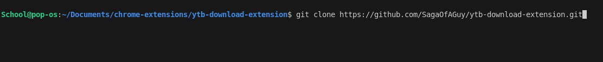
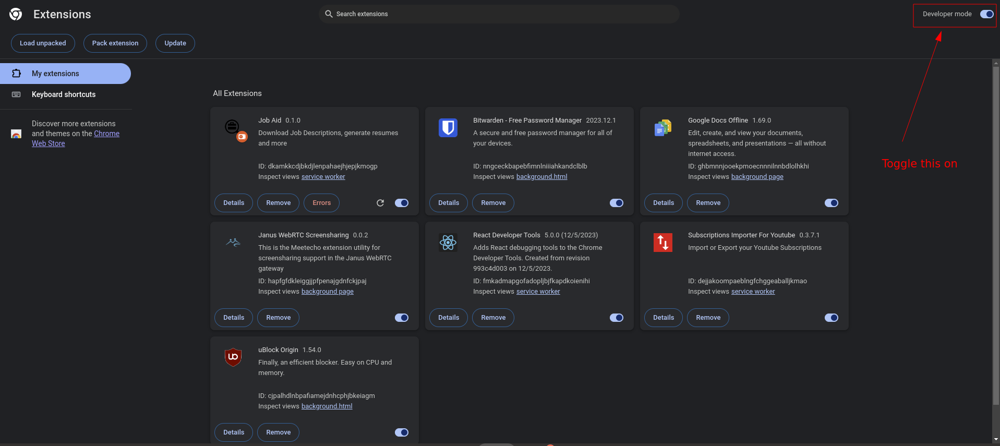
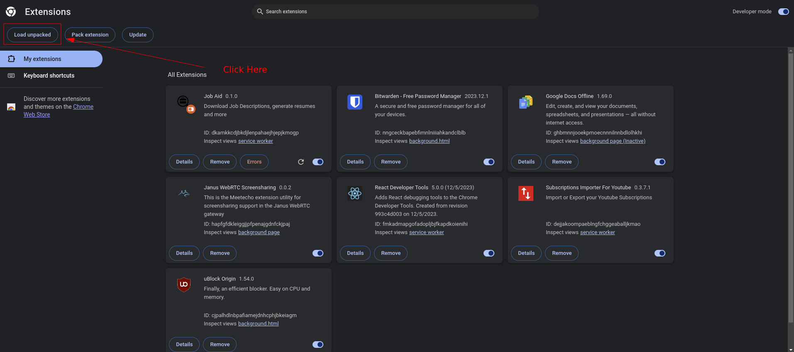
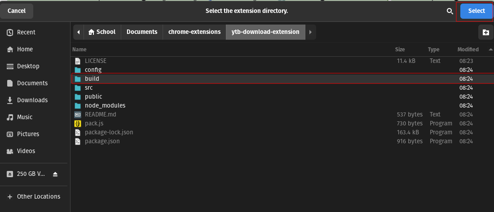
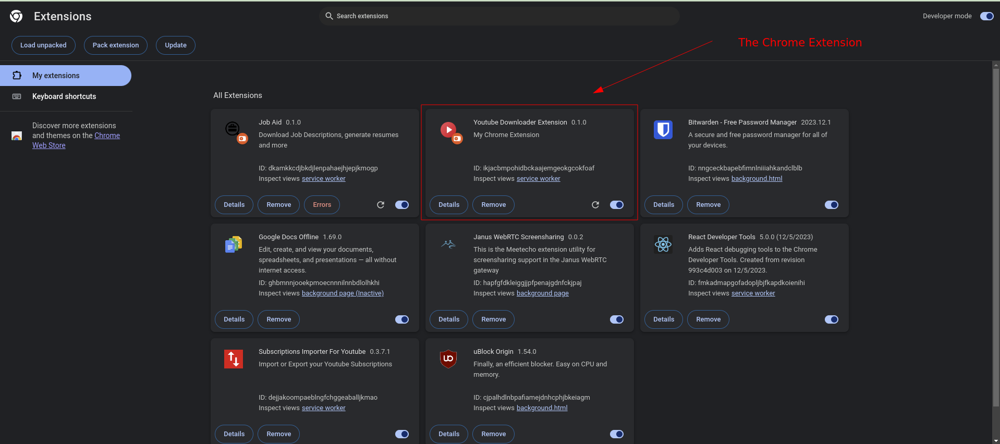
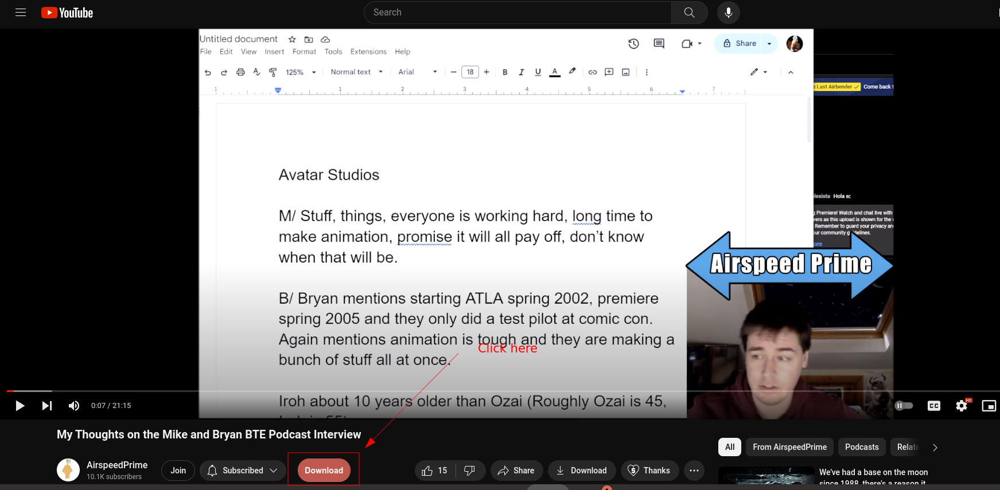
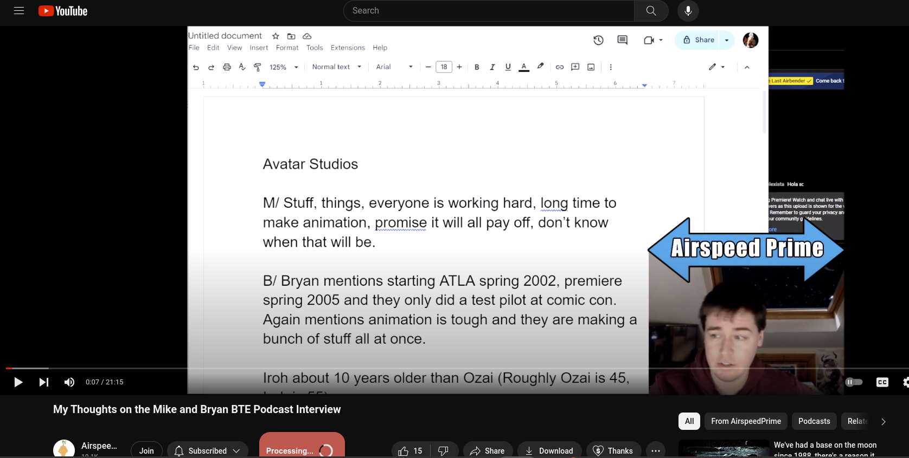
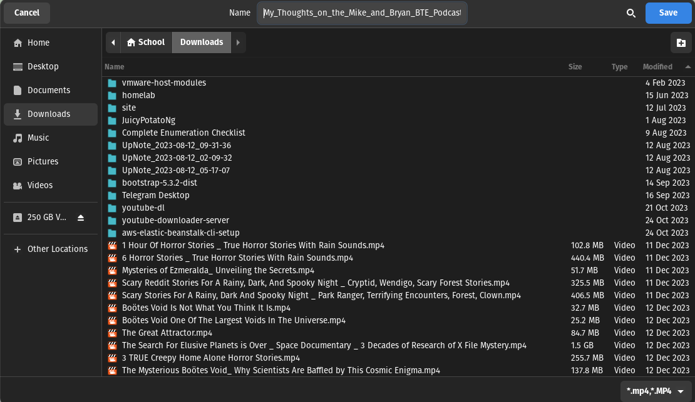
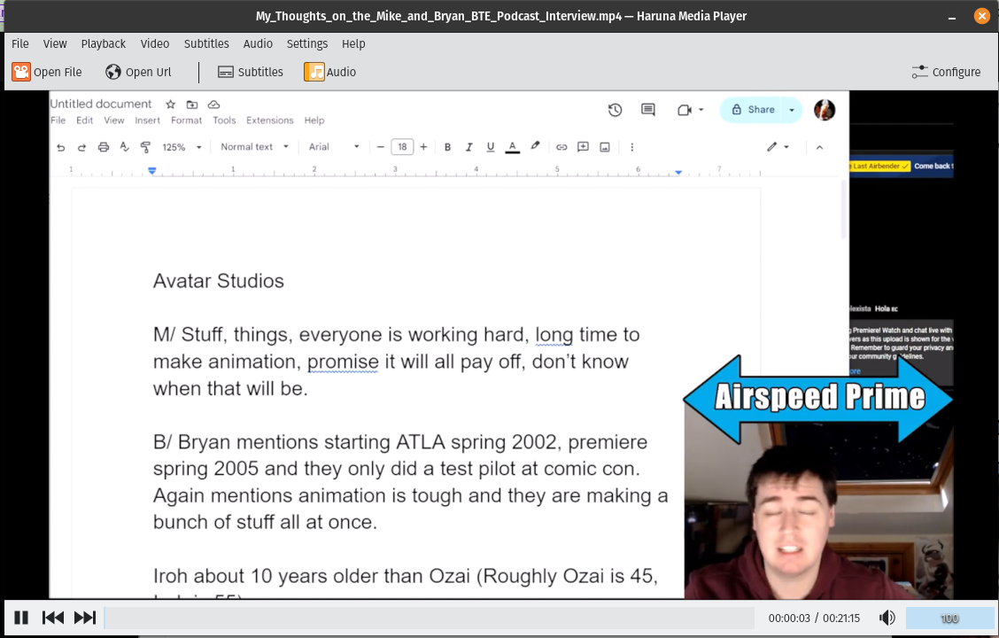

# Youtube Downloader Extension

Basic YouTube Video Downloader chrome extension

## Features

- Allows for user to download YouTube videos when they are on a YouTube Video page

## Install
1. Clone this repository
```
git clone https://github.com/SagaOfAGuy/ytb-download-extension.git
```



2. Open up the Chrome extensions page by going to `chrome://extensions` and enable the **"Developer Mode"** option




3. Click **"Load Unpacked"**




4. Import the `build` directory, and click the **"Select"** button



5. Observe that the chrome extension has been loaded in the browser: 


   

## Usage
1. Navigate to a YouTube video page and notice that there's a red "Download" button that appears on the page: 




2. Click the **"Download"** button. It may take a while for the video to download depending on how large the video file is. Notice that the button text has changed to **"Processing..."**




3. We can save the video to the local filesystem



4. After the video has been downloaded, we can view the video in our favorite video player: 




## Features to add
- Ability to choose video or audio format
- Ability to show download progress to the user


This project was bootstrapped with [Chrome Extension CLI](https://github.com/dutiyesh/chrome-extension-cli)


